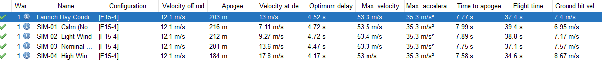
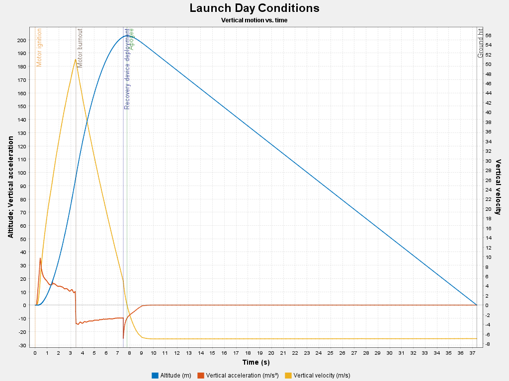

# Summer Rocketry Project

## Project Overview

This repository documents an independent summer aerospace engineering project focused on the design, build, simulation, and planned launch of a beginner-level model rocket.

The goal of this project is to stay technically active over the summer, gain hands-on aerospace experience, strengthen simulation and documentation skills, and create a project that can be discussed in future internship and engineering interviews.

## Project Objectives

* Select an appropriate beginner-level model rocket kit
* Build the rocket using safe commercial hobby rocketry practices
* Model and simulate the rocket using OpenRocket
* Evaluate center of gravity, center of pressure, stability margin, predicted apogee, velocity, acceleration, and recovery performance
* Prepare a launch plan using a commercially manufactured motor
* Compare simulated performance against observed flight results after launch
* Document the project in a clear engineering-style format

## Rocket Selected

The selected rocket kit is a beginner-level LOC Graduator Precision rocket. The project will focus on safe assembly, simulation, and flight planning rather than custom motor or propellant development.

## Tools and Software

* OpenRocket
* GitHub
* Digital scale
* Ruler or measuring tape
* Basic hobby tools
* Phone Camera for build documentation

## Project Deliverables

* Rocket selection notes
* OpenRocket simulation file
* Motor comparison table
* Mass and center of gravity measurements
* Build log with photos
* Launch readiness checklist
* Flight results summary
* Final project report

## Current Status

Rocket ordered. Repository and project documentation setup in progress.

## Planned Timeline

* Week 1: Repository setup, project objective, OpenRocket installation
* Week 2: Initial simulation and rocket research
* Week 3: Kit inventory and build preparation
* Week 4: Main rocket assembly
* Week 5: Final mass, CG, and stability measurements
* Week 6: Launch planning and final simulation
* Week 7–8: Launch attempt or backup launch preparation
* Week 9–10: Final report and resume/portfolio update

 INSTINCT — Summer Rocketry Project

**Independent aerospace engineering project: build, calibration, simulation, flight test, and post-flight analysis of a LOC Precision Graduator.**


## Project outcome

INSTINCT was completed and successfully flown on **August 8, 2026** at the Hearne launch site on an **Estes F15-4**. The rocket flew nearly vertically, deployed its parachute, landed roughly **20 ft (6 m) from the pad**, and was recovered with **no damage beyond light dirt**.

The engineering focus was not just assembling the kit. The project closed the loop from a manufacturer baseline to a measured as-built model, wind-sensitivity simulations, launch-day reconstruction, and qualitative validation against the real flight.

## Key results

| Metric | Result |
|---|---:|
| Rocket | LOC Precision Graduator — **INSTINCT** |
| Final dry mass | **462 g** without motor |
| Manufacturer-model mass | **412 g** |
| Build mass growth | **+50 g / +12.1%** |
| Measured dry CG | **60.5 cm aft of nose tip** |
| CG measurement | Average of **5 independent string-balance trials** |
| Motor | **Estes F15-4** |
| OpenRocket loaded mass | **565 g** |
| Loaded CG | **66.5 cm aft of nose tip** |
| Center of pressure | **81.2 cm aft of nose tip** |
| Loaded stability | **2.21 calibers** |
| Launch guide | **1010 rail**, ~2.75 m usable travel |
| Launch-day predicted apogee | **203 m (666 ft)** |
| Rail-exit velocity | **12.1 m/s** |
| Maximum velocity | **53.3 m/s** |
| Maximum acceleration | **35.3 m/s² (~3.6 g)** |
| Predicted time to apogee | **7.77 s** |
| Predicted flight time | **37.4 s** |
| Actual recovery | Successful, ~20 ft from pad |

## Wind sensitivity



The final calibrated model was run through calm, light, nominal, high-wind, and reconstructed launch-day conditions. The primary trend was a decrease in predicted apogee and an increase in deployment/landing velocity as wind increased.

| Case | Apogee | Deployment velocity | Ground-hit velocity |
|---|---:|---:|---:|
| Calm | 216 m | 7.11 m/s | 6.95 m/s |
| Light wind | 212 m | 9.27 m/s | 7.17 m/s |
| Nominal wind | 201 m | 13.6 m/s | 7.57 m/s |
| High wind | 184 m | 17.8 m/s | 8.67 m/s |
| Launch day | 203 m | 13.0 m/s | 7.40 m/s |

## Launch-day flight profile



The F15-4 simulation predicted ejection at about **7.45 s** and apogee at **7.77 s**, placing recovery deployment approximately **0.32 s before apogee**. The modeled optimum delay was **4.52 s**, reasonably close to the motor's fixed 4-second delay.

## Engineering workflow

```text
Manufacturer baseline
        ↓
Kit inventory + pre-build measurements
        ↓
Physical construction and finishing
        ↓
As-built mass / CG calibration
        ↓
OpenRocket hardware + motor configuration
        ↓
Wind sensitivity + launch-day simulation
        ↓
Club launch and successful recovery
        ↓
Post-flight comparison + documented lessons learned
```

## Repository guide

| Folder | Contents |
|---|---|
| [`build-log/`](build-log/) | Reconstructed build journal from dated notes, photos, and project discussions |
| [`data/`](data/) | Kit measurements, as-built values, simulation summary, raw launch-day export, flight log |
| [`docs/`](docs/) | Engineering writeups, simulation analysis, flight report, lessons learned, portfolio summary |
| [`simulations/`](simulations/) | Manufacturer baseline, final-model location, raw export, plots, screenshots |
| [`photos/`](photos/) | Kit inventory plus folders for final build/launch photos |
| [`flight/`](flight/) | Flight evidence notes and optional video location |
| [`INSTINCT_project_tracker.xlsx`](INSTINCT_project_tracker.xlsx) | Final spreadsheet dashboard and engineering tracker |

## Build log note

The physical project moved faster than the documentation. The build log was therefore **reconstructed after the fact** from dated GitHub files, retained measurements, photographs, and project discussions. Exact dates are used where known; intervening work is grouped into honest project phases rather than invented as a perfect daily laboratory log.

## Data-quality limitations

- No onboard altimeter was flown, so actual apogee, peak velocity, and acceleration are not available for quantitative validation.
- The physical launch rail was estimated from photographs/video at approximately 10 ft; the simulation used ~2.75 m of effective guided travel.
- The observed landing distance of ~20 ft was an estimate, not a surveyed measurement.
- Launch-day weather was reconstructed from hourly field/airport observations.
- OpenRocket retained one informational warning about a nose-cone/body-tube diameter discontinuity; the geometry was intentionally left consistent with the model/build.

These limitations are documented rather than tuned away after the flight.

## Safety

This project used commercially manufactured hobby-rocketry components and motors. The flight was conducted at an organized launch site. No motor, propellant, igniter, or pyrotechnic material was manufactured as part of the project.

## Start reading

1. [`docs/project-overview.md`](docs/project-overview.md)
2. [`build-log/README.md`](build-log/README.md)
3. [`docs/as-built-configuration.md`](docs/as-built-configuration.md)
4. [`docs/simulation-analysis.md`](docs/simulation-analysis.md)
5. [`docs/flight-report`](docs/flight-report)
6. [`docs/post-flight-analysis.md`](docs/post-flight-analysis.md)
7. [`docs/lessons-learned.md`](docs/lessons-learned.md)
8. [`docs/portfolio-summary.md`](docs/portfolio-summary.md)

## Repository status

**Project status: COMPLETE / FLIGHT TESTED**


## Safety Note

This project uses commercially manufactured hobby rocketry components only. It does not involve making motors, propellant, igniters, or pyrotechnic materials.
