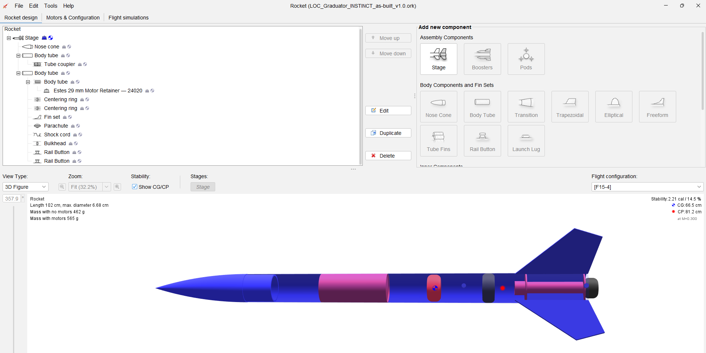

# As-Built Configuration

## Baseline vs finished rocket

| Parameter | Manufacturer / pre-build | Final as-built |
|---|---:|---:|
| Length | 102 cm | ~102 cm |
| Maximum diameter | 6.68 cm | 6.68 cm |
| Dry mass | 412 g | **462 g** |
| Dry CG | 59.7 cm | **60.5 cm measured** |
| CP | 81.2 cm | 81.2 cm model |

Final mass growth was **50 g (12.1%)** above the manufacturer digital model.

## Dry-mass definition

The 462 g dry mass represents the flight-ready rocket with:

- nose cone and payload section;
- airframe, fins, coupler, bulkhead;
- parachute, shock cord, and recovery protection;
- rail buttons and fasteners;
- payload/nose retention screw;
- motor-retainer base and removable cap;
- paint, primer, finish, decals, epoxy, and glue;

but **without the motor or igniter**.

An earlier 452 g measurement was rejected after noticing that the retainer cap had been omitted from the weighing.

## CG measurement

Five independent string-balance measurements produced a mean dry CG of **60.5 cm aft of the nose tip**.

- Measurement/readout uncertainty applied to each trial: **±0.1 cm**
- Number of trials: **5**
- Sample standard deviation: **0.77 cm**
- Standard error of the mean: **0.34 cm**

The ±0.1 cm value represents the assumed measurement resolution/reading uncertainty and is distinct from the observed trial-to-trial spread.

## Rail buttons

- Type: 1010
- Quantity: 2
- Spacing: 10.00 in / 25.4 cm center-to-center
- Aft button: within roughly 1/8 in of booster aft end
- Launch lug: none

Absolute nose-datum positions in the tracker are derived/approximate because the most reliable physical measurement was the button spacing and aft-edge placement. The final `.ork` file remains the controlling record for exact modeled placement.

## Motor retainer

The retainer is an Estes 29 mm screw-on retainer, model 24020.

- Published mass: 13.3 g
- Published length: 2.96 cm
- Outer diameter: 4.42 cm

Because the complete retainer is already included in the 462 g measured stage mass, its separate component mass must not be added again on top of the stage override.

## F15-4 loaded configuration

The final OpenRocket model displays:

- Loaded mass: **565 g**
- Loaded CG: **66.5 cm aft of nose**
- CP: **81.2 cm aft of nose**
- Stability: **2.21 calibers**

